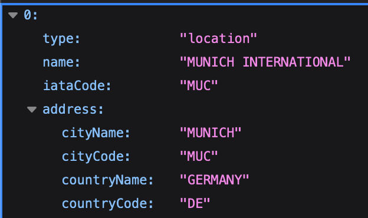

# Flight Search Backend
## Requirements
The following tools are required to be installed to run this project:
- Colima
- Java 21 (openjdk 21.0.4)
- Gradle 8.1
- Docker (CLI) v27.1.2
- Docker Compose

## API endpoints
### Airports
- /api/airports

This endpoint takes a GET request, with a "keyword" parameter such as "Hermosillo", "Guadalajara" and returns an array of all the results that match the query. This results include the IATA for the airport related to the location you entered, the city, and country codes and names, among other things. For example:

### Flights
- /api/flights

This endpoint takes a GET request and requires the following parameters to be set:
- **originLocationCode=**  IATA Code for the depature airport
- **destinationLocationCode=** IATA Code for the arrival airport
- **departureDate=** The desired departure date with the following format: "YYYY-MM-DD"
- **returnDate=** (Optional) The desired return date with the following format: "YYYY-MM-DD"
- **adults=** How many adult tickets are required, minimum of one (1)
- **nonStop=** Set as true to get only direct flights, false to get results with layovers
- **currency=** Which currency to show the flights prices (USD, MEX, EUR)
 

## Enviroment variables
This project uses multiple environment variable for authenticating the user and granting access to the Amadeus API, which should be located here:
-  src/main/resources/application.properties

An empty template can be found in this directory, just make sure the remove the ".example" in the end and fill it out with your own credentials.

## Docker
Once the environment variables, you may now run the project as Docker container.

First, create the Gradle build and run it with the following command:
> ./gradlew build && java -jar build/libs/flightsearch-0.0.1-SNAPSHOT.jar  

To create an image build, please run the following command:
> docker build -t flight-search-back .

And to run it using Docker compose, run the following command:
> docker compose up

### Changing Dockerfile
If you need to change anything from "Dockerfile", please make sure to replicate this change on the "Dockerfile.dev" file as well, since this is the one used when running both frontend and backend as a single Docker compose.

## Project
To run the project:
> ./gradlew build && java -jar build/libs/flightsearch-0.0.1-SNAPSHOT.jar  

To run the tests:
> gradle test

## Installing Docker in MacOs

This is beyond the purpose of this README.md, but here are some helpful resources:
- https://dev.to/elliotalexander/how-to-use-docker-without-docker-desktop-on-macos-217m
- https://dev.to/mochafreddo/running-docker-on-macos-without-docker-desktop-64o
- https://stackoverflow.com/questions/60992814/docker-compose-command-not-available-for-mac/77142331#77142331