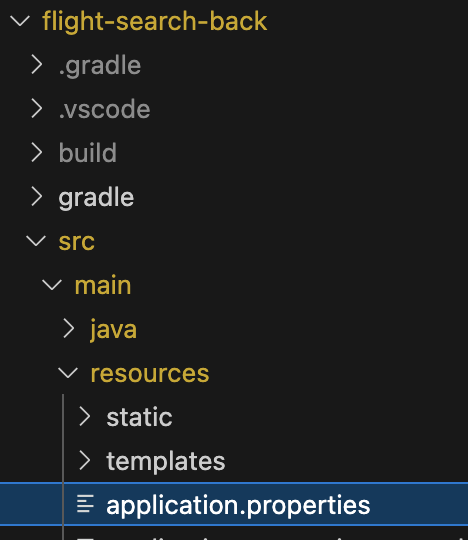

# Flight Search Backend

## Enviroment variables
This project uses multiple environment variable for authenticating the user and granting access to the Amadeus API, which should be located here:
-  src/main/resources/application.properties

An empty template can be found in this directory, just make sure the remove the ".example" in the end and fill it out with your own credentials.

## Docker
Once the environment variables, you may now run the project as Docker container.

First, create the Gradle build and run it with the following command:
> ./gradlew build && java -jar build/libs/flightsearch-0.0.1-SNAPSHOT.jar  

To create an image build, please run the following command:
> docker build -t flight-search-back .

And to run it using Docker compose, run the following command:
> docker compose up

### Changing Dockerfile
If you need to change anything from "Dockerfile", please make sure to replicate this change on the "Dockerfile.dev" file as well, since this is the one used when running both frontend and backend as a single Docker compose.

## Project
To run the project:
> ./gradlew build && java -jar build/libs/flightsearch-0.0.1-SNAPSHOT.jar  

To run the tests:
> gradle test
